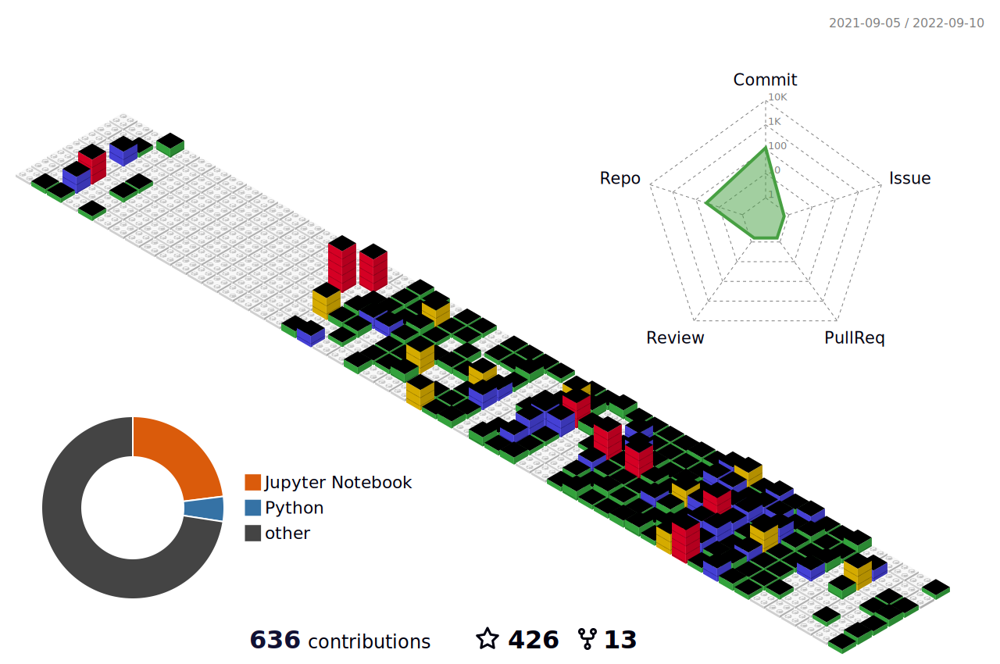

<h3 align="center">"Data that is loved tends to survive"  </h3>

<h3 align="center">Hi 👋, I'm Tamanna</h3>

<h2> About Me </h2>

This is the place where I opensource stuff and break things...

- 🔭 I’m currently working on something cool :wink:
- 💬 I'm open to opportunities in the field of Data Science and Engineering, AI, Machine Learning, NLP, Deep Learning and Computer Vision
- 😄 Pronouns: She/her :girl:
- ⚡ Fun fact: I :heart: :dog:s and ☕
- You can support my work by [buying me a coffe] ☕, on [sponsoring me on GitHub] !!

<h2> Connect with me  </h2>

 

 

 

 

## Tech Stack

                         

 

 

 
 

 

 
--------------------------------------------------------------------------------------------------------------

Profile Visits :  

